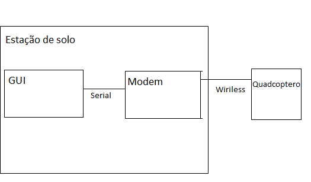
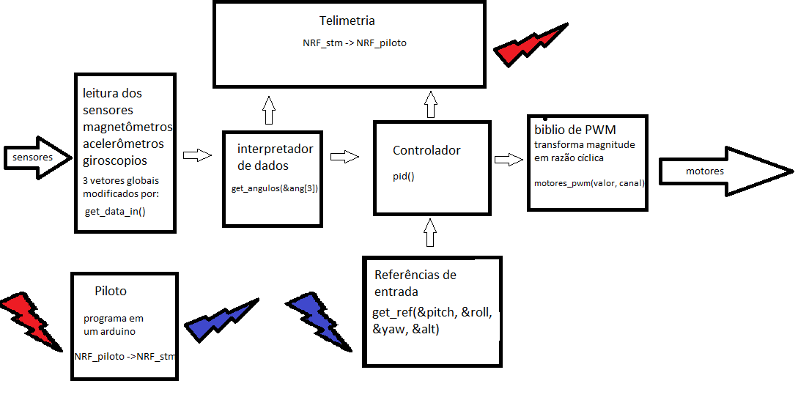
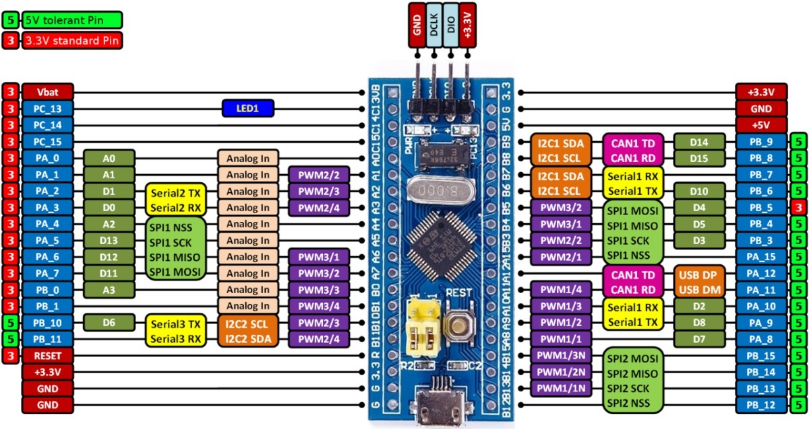
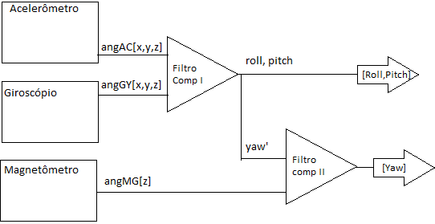
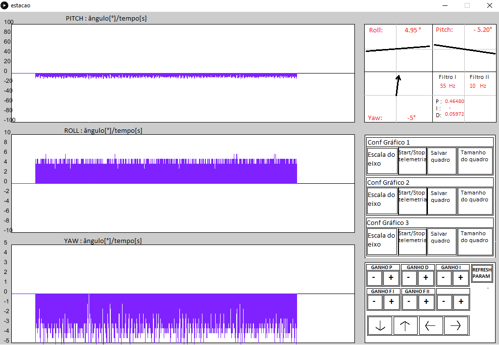
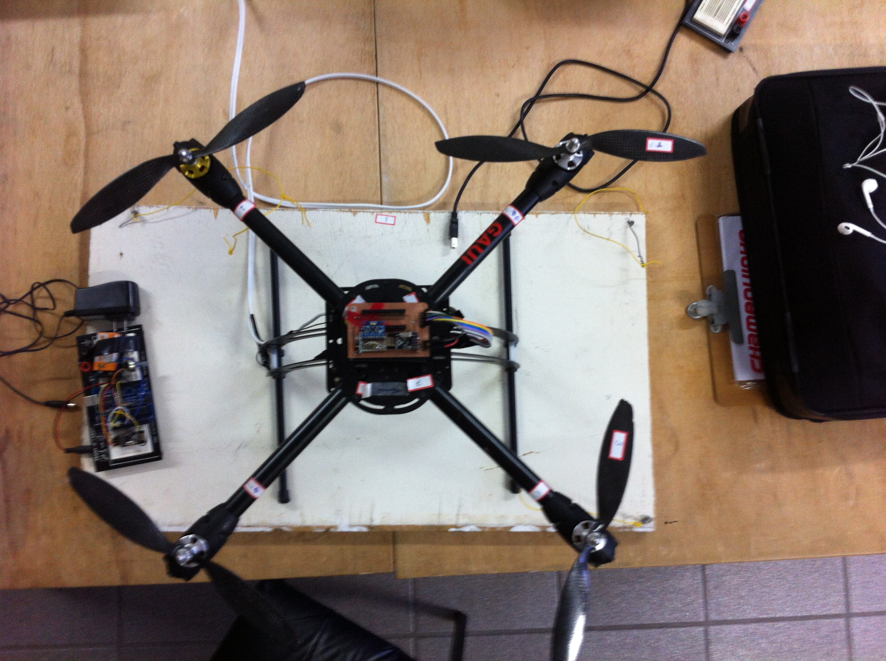

# software_avant
## Estudo de VANTs (Veículos aéreos não tripulados) 
### Diagrama da plataforma

### Fluxo dos dados na plataforma 

### Núcleo: STM32F1

### Biblioteca para Leitura de ângulos de Euler usando IMU MPU6050: Completo.

### Biblioteca para Controle PWM em motores brushless: Completo.

### Comunicação remota entre aeronave e estação de solo (outro microcontrolador ligado a uma máquina local via porta serial): Completo. 

### Controle de estabilidade de vôo com controladores PID: incompleto. 

### Interface gráfica (GUI) para controle e telemetria: incompleto.

### Imagem da estrutura de testes:

Trabalhos e artigos publicados:

[Modelagem de filtros complementares](https://github.com/TarsisNatan/software_avant/blob/v0.5_b(1)/Docs/Artigo_tarsis_cricte.pdf)

[Software de controle de Voo](https://github.com/TarsisNatan/software_avant/blob/v0.5_b(1)/Docs/BanerJAI_2018-converted.pdf)
